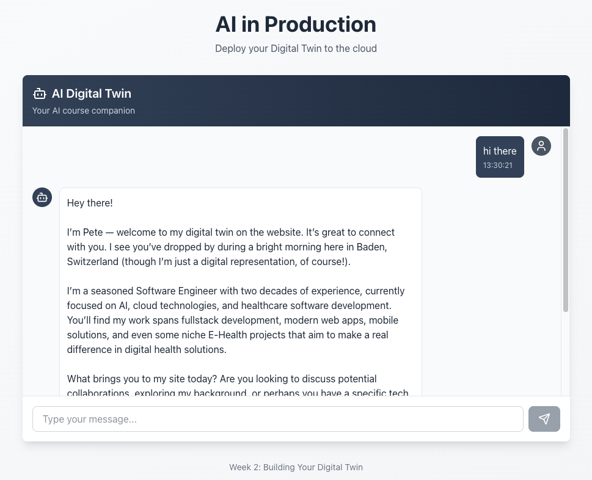

# Twin

Twin ist ein kleines Full-Stack-Projekt für einen AI Digital Twin: ein Next.js-Frontend mit Chat-Oberfläche und ein Python/FastAPI-Backend, das Antworten über AWS Bedrock erzeugt und Konversationen speichert.

## Stack

- Frontend: Next.js 16.3.3, React 19.2.8, TypeScript 5
- Backend: Python 3.12, FastAPI, Mangum und Boto3
- AI: AWS Bedrock mit Amazon Nova 2 Lite
- Infrastructure as Code: Terraform 1.16.0 und AWS Provider 6.x
- CI/CD: GitHub Actions mit OIDC-Authentifizierung für AWS
- Storage: lokale JSON-Dateien oder Amazon S3

## Projektstruktur

- `frontend/` enthält die Weboberfläche
- `backend/` enthält API, Bedrock-Integration und Memory-Handling
- `terraform/` enthält die AWS-Infrastruktur für Lambda, API Gateway, S3 und CloudFront
- `.github/workflows/` enthält die wiederverwendeten Day-5-Workflows für Deployment und Destroy
- `scripts/` enthält die von den Workflows verwendeten Deploy- und Destroy-Skripte
- `memory/` speichert lokale Chat-Verläufe als JSON
- `week2/` enthält die Kursnotizen

## Lokal starten

### Frontend

```bash
cd frontend
npm install
npm run dev
```

Das Frontend läuft danach unter `http://localhost:3000`.

### Backend

Voraussetzungen: Python 3.12+, `uv` und gültige AWS-Credentials für Bedrock.

```bash
cd backend
uv sync
uv run uvicorn server:app --reload --host 0.0.0.0 --port 8000
```

Die API läuft danach unter `http://localhost:8000`.

Für lokale Entwicklung verwendet das Frontend standardmäßig `http://localhost:8000`. Beim Deployment setzt der Day-5-Workflow `NEXT_PUBLIC_API_URL` auf die von Terraform erzeugte API-Gateway-URL.

## API

- `GET /health` Health Check
- `POST /chat` sendet eine Nachricht an den Digital Twin
- `GET /conversation/{session_id}` lädt einen gespeicherten Verlauf

## Terraform

Das Projekt wurde mit Terraform 1.16.0 getestet. Die Konfiguration in `terraform/versions.tf` unterstützt Terraform ab Version 1.0 und verwendet den AWS Provider in Version 6.x:

```hcl
terraform {
	required_version = ">= 1.0"

	required_providers {
		aws = {
			source  = "hashicorp/aws"
			version = "~> 6.0"
		}
	}
}
```

Die Anwendungsressourcen und der Terraform-State liegen in `eu-central-2`. AWS Bedrock verwendet separat `eu-central-1`, weil das Inference Profile `global.amazon.nova-2-lite-v1:0` dort verfügbar ist. Der ACM-Provider bleibt für CloudFront-Zertifikate in `us-east-1`, wie von AWS vorgeschrieben.

## Day 5: GitHub Actions

Die Inhalte aus Day 5 werden direkt im Projekt verwendet:

- `.github/workflows/deploy.yml` deployt bei jedem Push auf `main` oder manuell nach `dev`, `test` oder `prod`.
- `.github/workflows/destroy.yml` entfernt eine Umgebung nach manueller Bestätigung.
- `scripts/deploy.sh` und `scripts/destroy.sh` werden von den Workflows ausgeführt.
- GitHub authentifiziert sich ohne dauerhafte AWS-Zugangsschlüssel über OIDC und die Rolle `github-actions-twin-deploy`.
- Der globale GitHub-OIDC-Provider und die Deployment-Rolle sind Bootstrap-Infrastruktur und werden nicht im Terraform-State einer einzelnen Umgebung verwaltet.

Verwendete Actions und Laufzeiten:

- `actions/checkout@v4`
- `aws-actions/configure-aws-credentials@v5`
- `actions/setup-python@v5` mit Python 3.12
- `hashicorp/setup-terraform@v3`
- `actions/setup-node@v5` mit Node.js 22

Der vollständige Day-5-Deploy wurde erfolgreich getestet. Dabei liefen AWS-OIDC-Anmeldung, Terraform-Deployment, Backend-/Frontend-Build, S3-Synchronisierung und CloudFront-Invalidierung durch. Zusätzlich wurden `GET /health` und `POST /chat` gegen die bereitgestellte API erfolgreich geprüft.

- Anwendung: https://d1hzpxt9k7z1tg.cloudfront.net/
- API: https://9v5n9mm3wk.execute-api.eu-central-2.amazonaws.com/
- Erfolgreicher Testlauf: https://github.com/peterruler/twin/actions/runs/33963381741

## Demo Screenshots

### Digital-Twin Day 2 Demo


### Bedrock Day 3 Demo


### Terraform Day 4 Demo


### GitHub Actions Day 5 Demo


