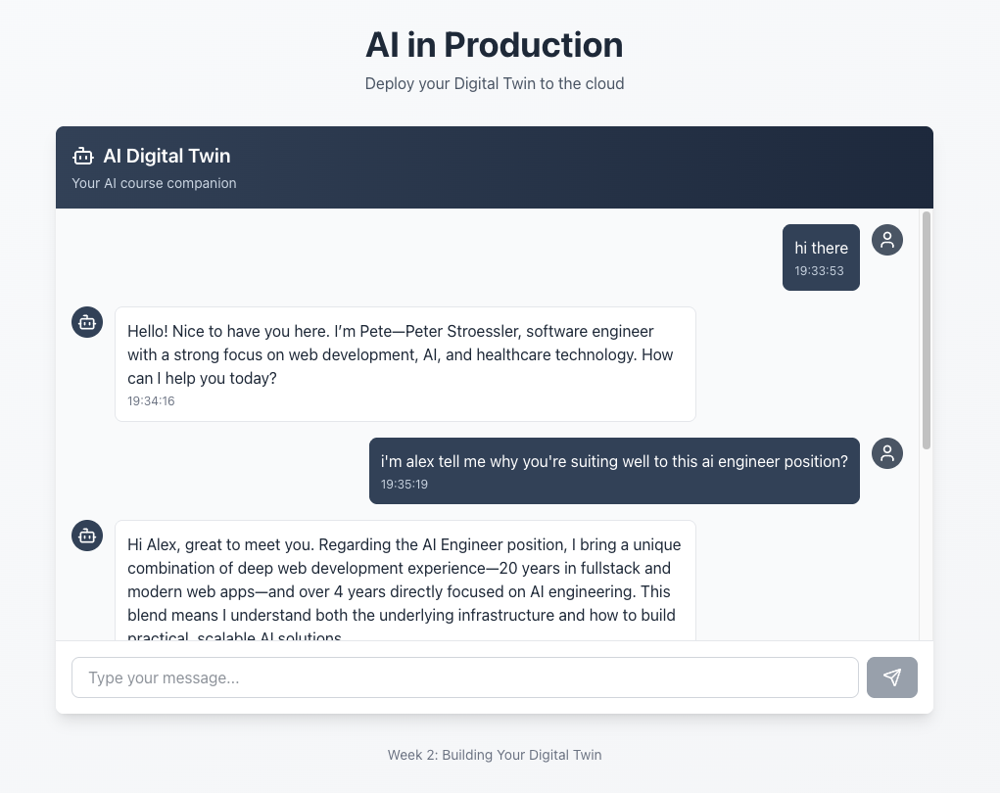
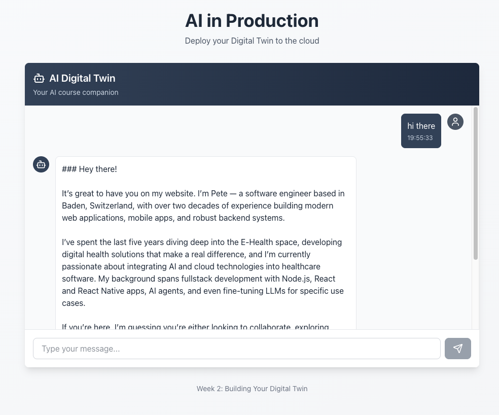
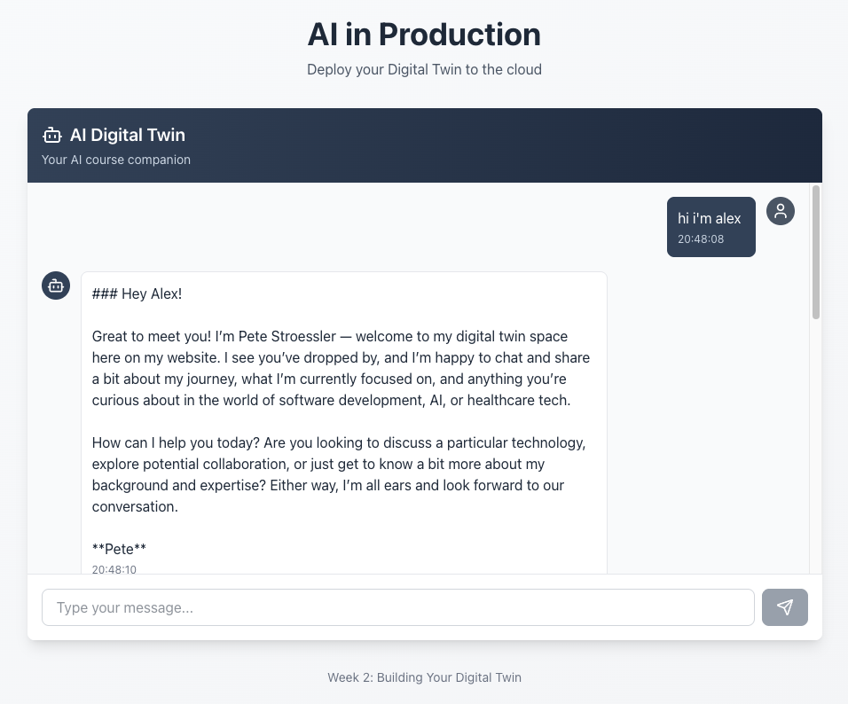

# Twin

Twin ist ein kleines Full-Stack-Projekt für einen AI Digital Twin: ein Next.js-Frontend mit Chat-Oberfläche und ein Python/FastAPI-Backend, das Antworten über AWS Bedrock erzeugt und Konversationen speichert.

## Stack

- Frontend: Next.js 16, React 19, TypeScript
- Backend: FastAPI, Uvicorn, Boto3
- AI: AWS Bedrock
- Storage: lokale JSON-Dateien oder S3

## Projektstruktur

- `frontend/` enthält die Weboberfläche
- `backend/` enthält API, Bedrock-Integration und Memory-Handling
- `memory/` speichert lokale Chat-Verläufe als JSON
- `week2/` enthält die Kursnotizen

## Lokal starten

### Frontend

```bash
cd frontend
npm install
npm run dev
```

Das Frontend läuft danach unter `http://localhost:3000`.

### Backend

Voraussetzungen: Python 3.12+, `uv` und gültige AWS-Credentials für Bedrock.

```bash
cd backend
uv sync
uv run uvicorn server:app --reload --host 0.0.0.0 --port 8000
```

Die API läuft danach unter `http://localhost:8000`.

Hinweis: Das Frontend sendet aktuell Requests an eine deployte API-URL in `frontend/components/twin.tsx`. Für ein rein lokales Setup muss diese URL angepasst werden.

## API

- `GET /health` Health Check
- `POST /chat` sendet eine Nachricht an den Digital Twin
- `GET /conversation/{session_id}` lädt einen gespeicherten Verlauf

## Demo Screenshots

### Digital-Twin Day 2 Demo



### Bedrock Day 3 Demo



### Terraform Day 4 Demo


